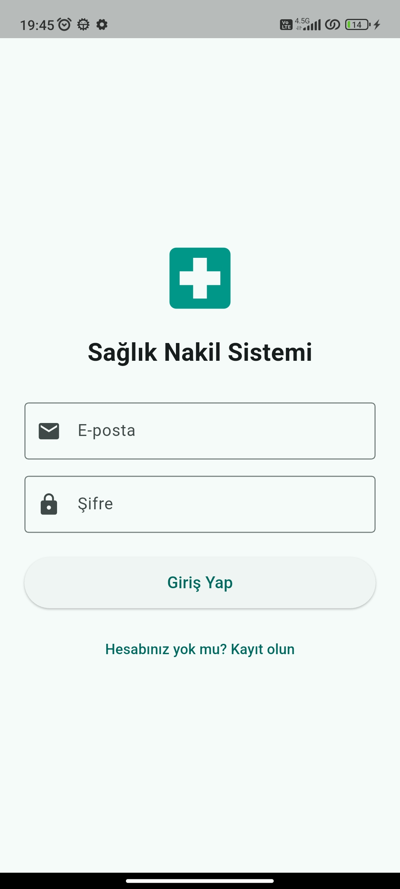
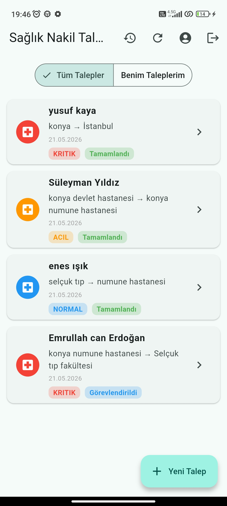
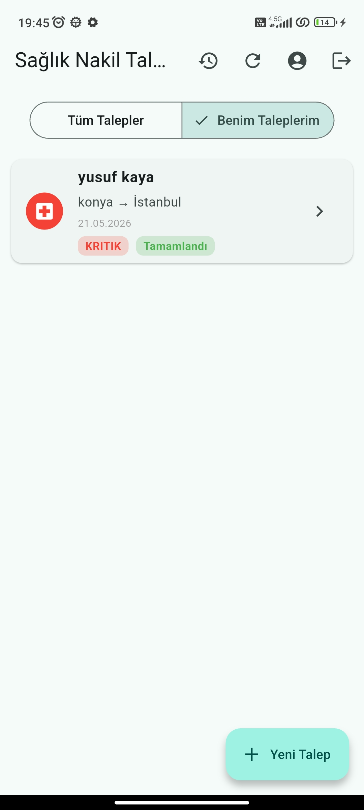
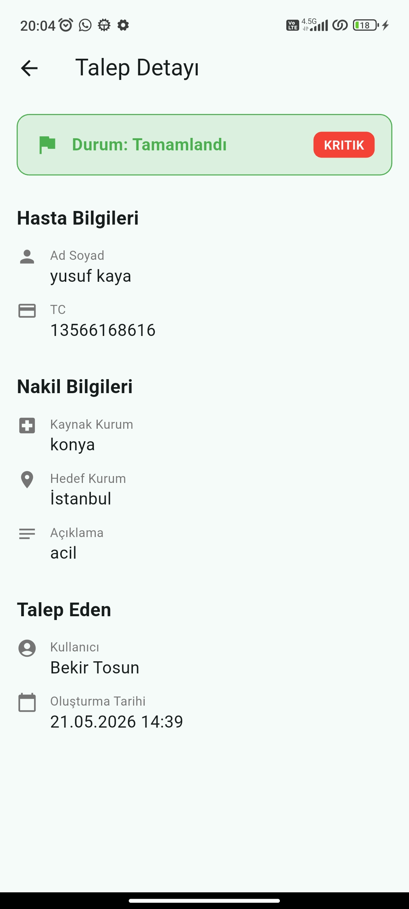
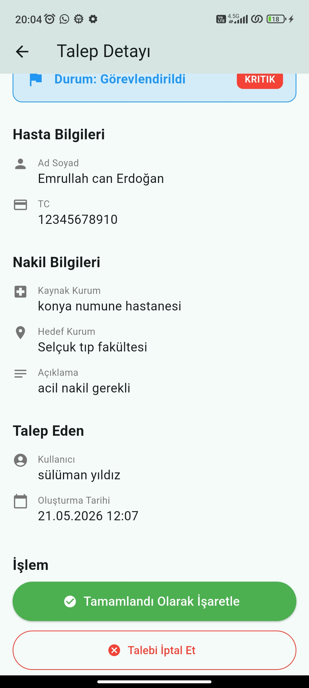
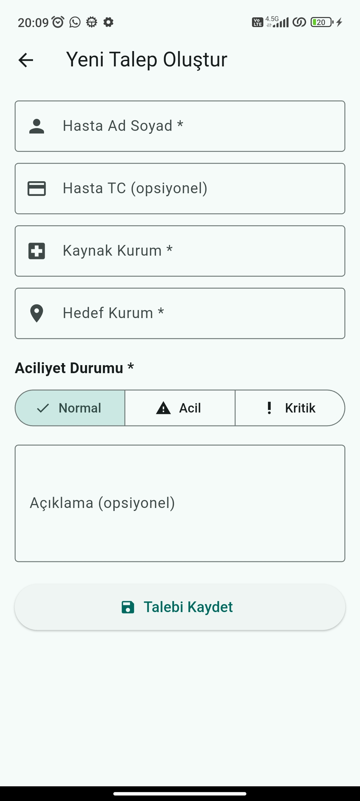
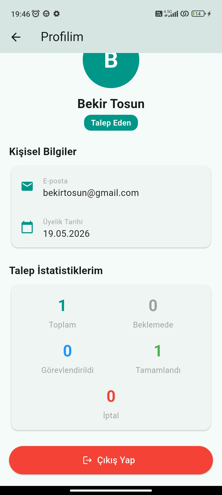
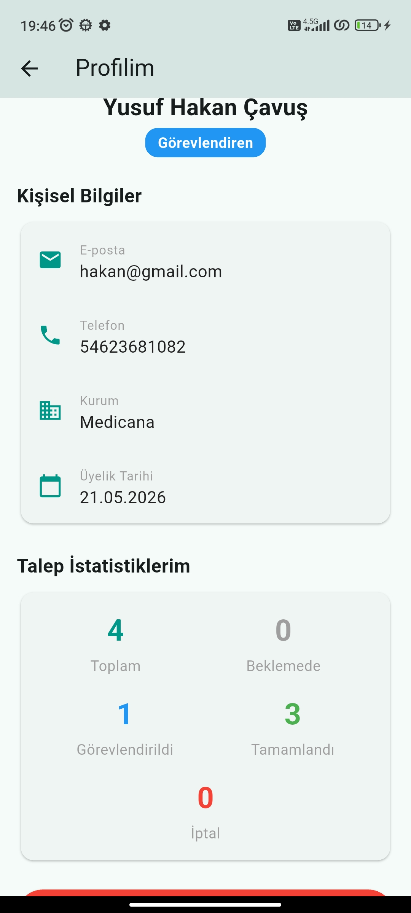
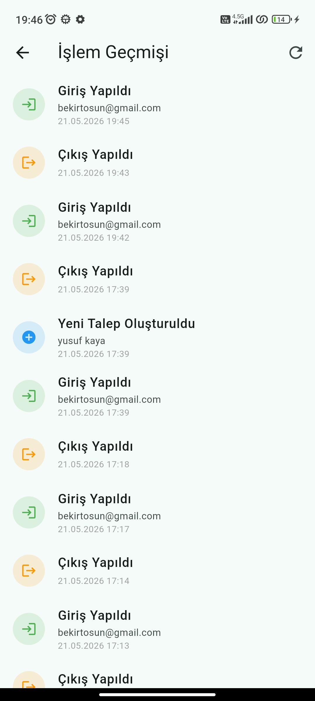

# # Sağlık Nakil Talep ve Görevlendirme Sistemi

**Öğrenci:** Bekir Tosun  
**Öğrenci No:** 243301085  
**Ders:** Mobil Programlama

## Uygulama Hakkında

Sağlık Nakil Talep ve Görevlendirme Sistemi, hastane personelinin hasta nakil
taleplerini oluşturmasına ve görevlendirme yapılmasına olanak tanıyan bir mobil
uygulamadır. İki farklı kullanıcı rolü bulunmaktadır:

- **Talep Eden:** Hasta nakil talebi oluşturur, kendi taleplerini takip eder,
  iptal edebilir.
- **Görevlendiren:** Tüm talepleri görüntüler, görevlendirme yapar,
  tamamlandı/iptal olarak işaretler.

## Test Hesapları

| Rol | E-posta | Şifre |
|-----|---------|-------|
| Talep Eden | bekirtosun@gmail.com | 123456 |
| Görevlendiren (Dispatcher) | hakan@gmail.com | 123456 |

## Kullanılan Paketler

| Paket | Versiyon | Amaç |
|-------|----------|------|
| supabase_flutter | ^2.5.0 | Kimlik doğrulama ve veritabanı |
| cupertino_icons | ^1.0.8 | iOS uyumlu ikonlar |

## Ekranlar

1. **Giriş / Kayıt** — E-posta ve şifre ile giriş, iki rol seçeneği ile kayıt
2. **Talep Listesi** — Tüm talepler veya sadece kendi talepleri filtresi
3. **Talep Detayı** — Hasta bilgileri, nakil güzergahı, durum yönetimi
4. **Yeni Talep Formu** — Hasta bilgisi, aciliyet seçimi, kurum bilgileri
5. **Profil** — Kişisel bilgiler, istatistikler, çıkış
6. **İşlem Geçmişi** — Tüm log kayıtları kronolojik sırada

## Ekran Görüntüleri

### Giriş Ekranı

### Talep Listesi

### Talep Detayı

### Talep Ekle

### Profil Ekranı

### Log Ekranı

## Özellikler

- Supabase Auth ile kullanıcı kayıt, giriş ve çıkış
- Oturum kalıcılığı — uygulama kapatılıp açılsa giriş devam eder
- Rol bazlı erişim kontrolü
- Gerçek zamanlı veri (Supabase Postgres)
- Tüm işlemler otomatik log kaydı tutulur